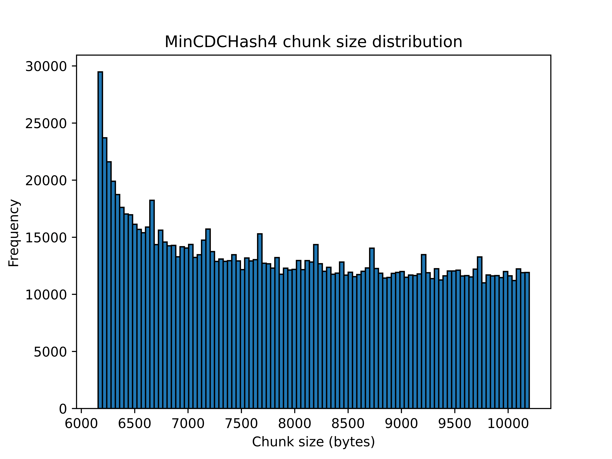
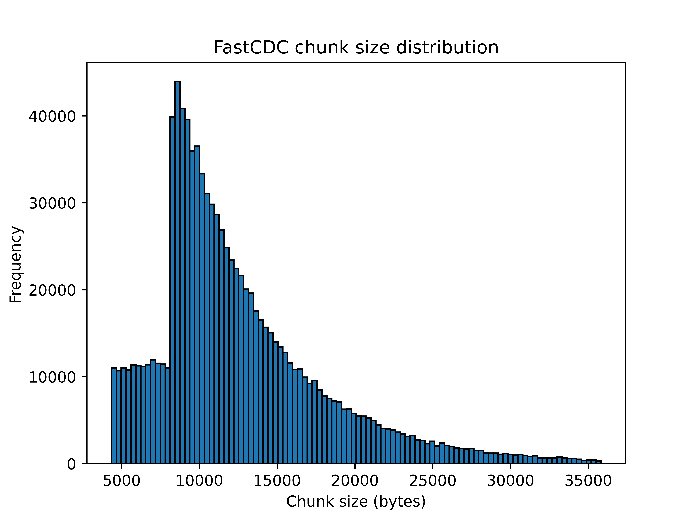

# MothCDC

> A fork of [MinCDC](https://github.com/orlp/mincdc) that adds a *caterpillar*
> layer for metadata-efficient content-defined chunking on redundant data. The
> algorithm described below is MinCDC; see [This fork](#this-fork-mothcdc) for
> what's added and why.

MinCDC is a very simple yet efficient content-defined chunking algorithm. It
splits your input data into chunks in such a way that the boundaries are defined
by the data itself. This means duplicate regions in large (sets of) files are
likely to have identical boundaries and can thus efficiently be found and
deduplicated.

To start using `mothcdc` add the following to your `Cargo.toml`:

    [dependencies]
    mothcdc = "0.7"

Please refer to [the documentation](https://docs.rs/mothcdc) for more
information on usage.


## This fork: mothcdc

MinCDC — the algorithm and its SIMD core — is Orson Peters' work. This fork
adds a *caterpillar* layer, an idea from the
[Chonkers algorithm](https://arxiv.org/abs/2509.11121) (Berger, 2025), with
vector acceleration in the style of VectorCDC (Udayashankar et al., FAST '25).

When data has a long run of repeated bytes — zeros, padding, the same block over
and over — mincdc cuts it into a flood of tiny chunks. Each chunk is a record you
have to store and track. The bytes dedupe down to almost nothing, but you still
keep every record: a mostly-empty 200 MiB disk image becomes ~182,000 of them.

The caterpillar collapses any run of byte-identical adjacent chunks into a
single record with a repeat count. On that disk image: **182,701 → 7,798
records (−96%)**, with no change to what is stored. A SIMD scan proves a run
once and skips the boundary search inside it, so runs chunk several times
faster than plain mincdc. A cheap probe keeps the cost near zero (~1%) on
data with no runs. When streaming, runs survive buffer refills, so a multi-GB
zero region is still one record.

The crate also ships a C API (`--features capi`) and a
[dedup-bench fork](https://github.com/russellromney/dedup-bench/tree/MothCDC-integration)
so it can be measured by the same harness as every other chunker.

The normal Cargo dependency builds only a Rust `rlib`. To produce the static
library used by C/C++ benchmark harnesses, run:

```sh
cargo rustc --release --features capi --lib -- --crate-type staticlib
```

### Benchmarks

All numbers come from [UWASL dedup-bench](https://github.com/UWASL/dedup-bench)
(the VectorCDC evaluation harness), with MothCDC plugged in as a chunking
technique — same loop, same timers, same dedup measurement as every other
algorithm. One AMD EPYC/AVX2 machine, one session, ~8 KiB target chunks.
Corpora: a raw Debian VM image (768 MiB), DEB `.ova` appliances (3 GiB, FAST
'25 dataset), six consecutive linux-6.6.x source tars (8 GiB, stand-ins for
backup generations), and enwik9 (1 GiB of Wikipedia text, never used for
tuning). MothCDC uses the recommended window `(min=4096, max=12288)`; the
"wide" row is `(2048, 14336)`.

Throughput, GiB/s:

| algorithm | raw VM | DEB .ova | LNX | enwik9 |
|---|---|---|---|---|
| AE-Min / FastCDC / RAM | 1.4 / 1.8 / 1.5 | 1.4 / 2.0 / 1.4 | 1.4 / 1.9 / 1.6 | 1.4 / 1.9 / 1.9 |
| SeqCDC | 3.2 | 6.4 | 7.1 | 5.9 |
| VectorCDC AE-Min (AVX2) | 14.0 | 5.4 | 7.9 | 8.5 |
| MothCDC (wide) | 10.6 | 11.4 | 9.5 | 8.0 |
| **MothCDC** | **16.6** | **15.5** | **14.1** | **13.4** |
| VectorCDC RAM (AVX2) | 23.4 | 19.6 | 24.7 | 29.6 |

Space savings (dedup-bench `measure-dedup`; same result on any machine):

| algorithm | raw VM | DEB .ova | LNX |
|---|---|---|---|
| **MothCDC** | **53.3%** | **5.2%** | **60.3%** |
| MothCDC (wide) | 53.2% | 4.9% | 59.2% |
| SeqCDC | 52.4% | 4.0% | 56.5% |
| FastCDC | 51.8% | 4.8% | 52.4% |
| AE-Min | 50.0% | 3.5% | 55.5% |
| RAM / VectorCDC RAM | 51.4% | 3.2% | 49.2% |

In short: **best dedup on every corpus at every chunk size tested (4K, 8K,
16K), and the fastest chunker except VectorCDC RAM** — which has the worst
dedup of any algorithm here. On the VM image (long zero runs) the caterpillar
turns 232k chunks into 56k records; on data without runs, records equal
chunks and the layer costs ~1%.

Caveats. mincdc runs slightly under the chunk-size target where others run
over, so normalizing for chunk size would trim some of the dedup edge over
AE-Min. SeqCDC ties plain mincdc's dedup at 16K targets. enwik9 shows the
speed holds on data we never tuned on, but says nothing about dedup — a
single text file has ~0% duplication for every algorithm. Absolute GiB/s
varies across shared hosts; compare within a column.

To reproduce: the corpus is public on Tigris
(`https://mincatcdc-bench-corpus.t3.storage.dev/corpus/MANIFEST.sha256`,
checksums included), the harness fork is linked above, and
`BENCH_CORPUS=<dir> cargo bench` runs the in-repo bench on your own files.
No build flags needed — SIMD width is detected at runtime (SSE2/AVX2/AVX-512
on x86_64, NEON on aarch64). Older tables live in `CHANGELOG.md` and
`examples/`.

### Choosing min/max

Prefer a narrow window with a high minimum. At the same ~8 KiB average,
`(4096, 12288)` chunks 40–50% faster than `(2048, 14336)` with equal or
better dedup on every corpus measured — the boundary search scans `max - min`
bytes per chunk. (This is the same window as upstream's "MinCDCHash4-l"
below.) Widening `max` buys fewer records but costs speed and dedup.
`cargo run --release --example frontier -- <paths>` prints the trade-off on
your own data. The hash constants make no measured difference; keep the
defaults.

### Using the caterpillar

It's a drop-in over the byte-slice chunker — iterate `Segment`s instead of
`Chunk`s:

```rust
use mothcdc::MothChunker;

for seg in MothChunker::new(&data, 4096, 12288) {
    // Store the unique content once. `dedup_key()` returns the bytes to
    // fingerprint regardless of variant (a single chunk or a repeated unit).
    store(hash(seg.dedup_key()), seg.dedup_key());
    // Record where it goes: offset, total byte length, and how many underlying
    // chunks this one record stands for.
    record(seg.offset(), seg.len(), seg.chunk_count());
}
```

`MothChunker::new` uses `MinCdcHash4` with the default hash parameters. For a
custom `Cdc` instance (e.g. non-default hash parameters), use
`MothChunker::with_cdc(&data, min, max, cdc)`, where `cdc` can be built with
`mothcdc::mincdc::MinCdcHash4::with_params(multiplier, addend)`.

`MothChunker` works on an in-memory slice; for inputs larger than memory,
`MothReadChunker` does the same coalescing over a streaming reader in
bounded memory (it yields borrowed `Segment`s valid until the next call, like
`ReadChunker`). Runs coalesce across buffer refills: a run's unit is copied
once — at most `max_size` bytes — when it crosses a refill, so even a
multi-gigabyte zero region is a single record. Everything else stays
zero-copy.

Offsets, segment lengths, and represented chunk counts are `u64`, so streaming
metadata remains correct on 32-bit targets. Individual boundary-search windows
are limited to `mothcdc::mincdc::MAX_CHUNK_SIZE`; the reader chunkers allocate
at least 4 MiB and provide fallible `try_new` constructors for invalid or
unallocatable configurations.

(An experimental second tier — content-defined *period detection* for
phase-rotating runs — was evaluated and removed: mincdc self-aligns to most
periods so it rarely helped, and it cost 76–99% throughput. See
`examples/CATBENCH_RESULTS.md` and the `proto/caterpillar-period` branch.)

To get the disk-image number, two 200 MiB APFS images were created
with `hdiutil` (`hdiutil create -size 200m -fs APFS ...`), each holding a real
source tree (the second also holds an extra version), so each image is ~92%
written-zero free space — not sparse holes, so `SEEK_HOLE` would not skip them.
Both images were chunked with `cargo run --release --example catbench` at
`min=2048, max=14336`. Plain mincdc produced 182,701 records; the caterpillar
produced 7,798, with identical deduplicated content. Full method and the other
corpora (Linux kernels, containers, SQLite, source trees) are in
`examples/REALBENCH_RESULTS.md`. Obviously the benchmark is specific to this case. YMMV. 

## Algorithm

The basic idea of MinCDC is to choose chunk boundaries based on the minimum
value of a sliding window over the input data. That is, if the desired chunk
size is between `min_size` and `max_size`, we find some `min_size <= i <=
max_size` such that `evaluate(bytes[i - w..i])` is minimized, where `w` is the
window size, breaking ties by choosing the earliest such `i`. Then we return
chunk `bytes[..i]` and repeat the process on the remainder `bytes[i..]`.

This library provides two SIMD-accelerated implementations of MinCDC, both with
a window size of 4:

 - `MinCDC4`, where the evaluation function is
   `u32::from_le_bytes(bytes[i - 4..i])`, i.e. a window size of 4 bytes
   interpreting the bytes as a little-endian `u32`, and
 - `MinCDCHash4`, where the evaluation function is
   `hash(u32::from_le_bytes(bytes[i - 4..i]))`. The hash function used is
   the very simple `hash(x) = x.wrapping_mul(a).wrapping_add(b)`, for
   some constants `a` and `b`.

**`MinCDCHash4` can be slightly (~10%) slower but is far more robust and
predictable, it is the recommended default**.

   
## Performance

MinCDC is several times faster than the commonly used
[FastCDC](https://crates.io/crates/fastcdc) while providing a similar amount of
deduplicating power. To benchmark this I downloaded all available Linux kernel
6.x.tar archives (`tools/download-linux.sh`) and ran the below algorithms on
them, all of them configured to target an expected chunk size of 8 KiB.

To determine the chunking speed I only chunked `linux-6.0.tar` while the file
was loaded into memory to avoid disk overhead. The dedup% is one minus the total
size of unique chunks divided by the total size of all input files (thus higher
is better). The normalized dedup% is the same percentage acquired from repeating
the experiment with different window sizes until the mean chunk size matched 8
KiB (+/- 1%). **This is important when comparing deduplication power since
smaller chunks typically means better deduplication.**

| Algorithm     |   AMD 9950X | Apple M2 Pro | Dedup% | Mean Chunk Size | Dedup% (normalized) |
| --------------|-------------|--------------|--------|-----------------|---------------------|
| MinCDCHash4-s | 41.3 GB / s |  23.8 GB / s | 61.08% |            8015 |              60.92% |
| MinCDCHash4-l | 44.5 GB / s |  15.7 GB / s | 61.57% |            8221 |              61.57% |
| MinCDC4-s     | 41.7 GB / s |  26.1 GB / s | 62.11% |            7383 |              60.52% |
| MinCDC4-l     | 42.0 GB / s |  16.9 GB / s | 64.51% |            6436 |              60.69% |
| FastCDC-s     |  6.6 GB / s |   4.1 GB / s | 54.38% |           12866 |              61.81% |
| FastCDC-l     |  5.2 GB / s |   3.2 GB / s | 54.87% |           12764 |              ~ 62%* |

Here the "-s" variants use a small window size of 8 KiB +/- 25%
(min=6144, max=10240), and the "-l" variants use a larger window size of
8 KiB +/- 50% (min=4096, max=12288). The maximum chunk size was increased
further for FastCDC as it inherently has a long tail of chunk sizes (see below),
this did not impact chunking speed much.

The normalized dedup% for FastCDC-l is marked with an asterisk because I was
unable to get the mean chunk size within 1% of 8KiB. The mean size would
suddenly jump from 7741 to 10846 just by making a tiny adjustment in window
size. For comparison, MinCDCHash4-l with a mean size of 7741 has a dedup% of
62.49% versus FastCDC-l's 62.75%.

## Chunk Distribution

Unlike most other content-defined chunking algorithms, the distribution of chunk
sizes generated by MinCDCHash4 is almost entirely uniform in the range
`min_size`, `max_size`. This makes it very predictable and well-behaved; the
expected chunk size is also very close to the mean chunk size. Compare that with
FastCDC's distribution for an expected chunk size of 8 KiB:

| MinCDCHash4 | FastCDC |
|-------------|---------|
|  | 

While the peak is at 8 KiB as expected for FastCDC, there is a long and heavy
tail, increasing the mean chunk size by a lot. MinCDCHash4 never creates a
chunk outside of the specified range, except for the last chunk which may be
smaller.

There is still a bias towards smaller chunks as MinCDC breaks ties in the
minimum value towards the earlier breakpoint, but this bias is relatively small.
